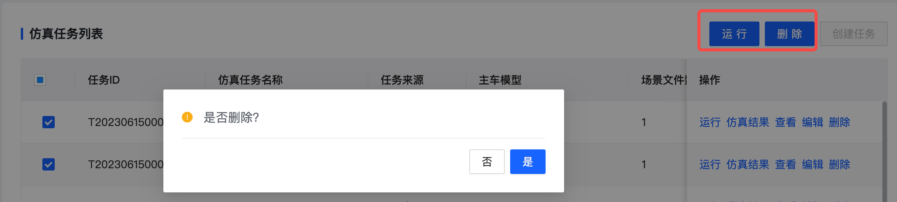

## 带二次确认弹窗的按钮
为按钮`a-button`增加二次弹窗确认

### label：string
按钮的文案，默认为‘删除’
### api：Function（Required）
点击按钮后调用的api
### doubleConfirm：Boolean
是否进行二次弹窗确认，默认为true

```
 <batch-button :api="batchRun" :double-confirm="false" label="运行"></batch-button> // 批量运行
 <batch-button :api="batchDelete"></batch-button> // 批量删除   
```
