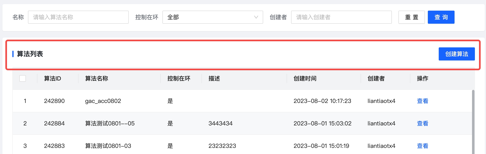

# 列表页头部封装
列表页title和按钮部分的样式封装

## title：String
页面title

## slot
列表页顶部按钮

```
<page-title title="算法列表">
  <a-button type="primary"  @click="router.push('/algorithm/edit/0')">创建算法</a-button>
</page-title>
```
