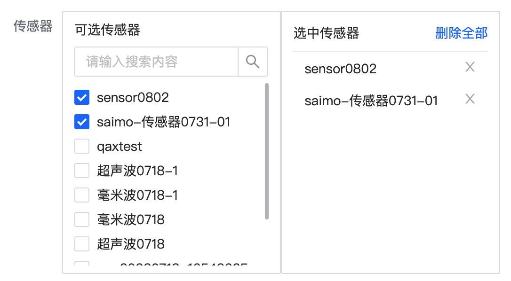

## scroll-transfer  
自定义穿梭框，支持：分页，查询

### titles: string[]
左右两侧列表的title，可以为空

### api： Funtion
获取数据的api函数

### targetKeys： String[]
默认选中的值

### fieldNames
options中`label、value`在api返回值中对应的字段，默认为`name、id`
``` javascript
  fieldNames: {
    type: Object as PropType<FieldNames>,
    default: () => ({ label: 'name', value: 'id'})
  }
```

## issues记录
+ 如果组件为必填项，需要在外面包裹一层`a-form-item-rest`   
因为该自定义组件内部包含多种类型的组件，`a-form-item`仅能支持包含一种   
为方便使用，将`a-form-item-rest`放在了该组件内部

```
<scroll-transfer v-model:target-keys="formState.sensors" :api="baseApi.sensor.getList"
    :titles="['可选传感器', '选中传感器']"></scroll-transfer>
```



